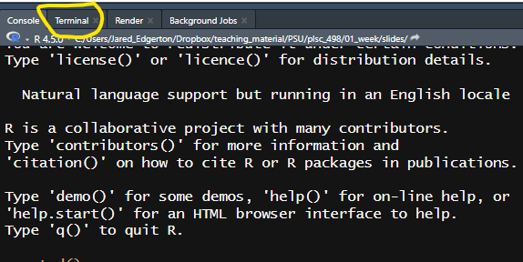

# Today’s Goal

Today is about **setup**, not mastery.

By the end of class, you should be able to:
- Open an R Project
- Run code end-to-end
- Use Git to save your work
- Push changes to GitHub

If you can do that, you are on track.

---

# Why We Start Here

Most problems in data work are not statistical.

They are:
- File paths
- Missing packages
- Version mismatches
- Unclear project structure

We start here so these problems do not derail us later.

---

# What Is an “Environment”?

Your environment includes:
- Your R version
- Installed packages
- Folder structure
- Working directory
- Git configuration

Two people can run the same code  
and get different results if environments differ.

---

# RStudio Projects

An R Project:
- Defines a stable working directory
- Makes file paths predictable
- Keeps analyses self-contained

If your code relies on `setwd()`,
something has gone wrong.

---

# What Git Is (and Is Not)

Git is **not**:
- Dropbox
- Google Drive
- Auto-save

Git **is**:
- A history of changes
- A record of decisions
- A way to recover mistakes

Nothing you do today is irreversible.

---

# Why We Use GitHub in This Course

GitHub is how we:
- Distribute labs
- Submit work
- Track progress
- Debug collaboratively

By next week, GitHub use is assumed.
Today is your on-ramp.

---

class: small-code

# The Core Git Commands

These are the only Git commands you need this semester:


```bash
# git clone <repo_url>
# Creates a local copy of a GitHub repository on your computer.
# - This is usually done once, at the beginning.
# - It downloads the entire project: files, folders, and commit history.
# - After cloning, you work inside this folder and do NOT clone again.

# git status
# Shows what has changed in your local project folder since the last commit.
# - Indicates modified files, new (untracked) files, and staged changes.
# - Use this first to understand what Git thinks has changed.

# git add .
# Stages changes so they will be included in the next commit.
# - The "." means: add all changes in the current directory and subdirectories.
# - This does NOT save anything yet; it prepares changes for committing.

# git commit -m "message"
# Creates a new snapshot (a commit) of the staged changes with a short message.
# - Commits are stored locally on your computer.
# - Messages should briefly describe what changed (what you would want to know later).

# git pull
# Downloads and merges the latest changes from the remote repository (GitHub)
# into your local copy.
# - Use this at the start of class to get new lab materials.
# - If the same lines were edited in both places, Git may ask you to resolve conflicts.

# git push
# Uploads your local commits to the remote repository (GitHub).
# - This is how you submit work and back it up.
# - If GitHub has changes you don't have, Git may require a pull first.

```

If you understand what these do, you are ahead of schedule.


---

# Git Commands: Mac vs Windows

**Mac**
- Git is usually pre-installed
- Use the Terminal app
- Commands run exactly as shown

**Windows**
- Git installs with *Git Bash*
- Use Git Bash or the RStudio Terminal
- Commands run exactly as shown

The commands are the same — only the terminal differs.


---

# Where Git Lives in Posit / RStudio

You have **three equivalent ways** to use Git in RStudio:

1. **Terminal tab**  
   - Runs the same commands as your system terminal
2. **Git tab**  
   - Button-based interface (good for beginners)
3. **Console**  
   - *Not* for Git commands (R only)

We will primarily use the **Terminal tab**.


.center[

]


---

# The Workflow We Will Use

Almost every lab follows this loop:

1. Pull the latest materials
2. Run code top-to-bottom
3. Make changes
4. Commit
5. Push

You will practice this loop today.

---

# What You Will Do in the Lab

In the next 45 minutes, you will:

- Install or verify R and RStudio
- Clone the course GitHub repository
- Open it as an R Project
- Run a setup script
- Create a standard folder structure
- Commit and push your work

---

# What to Do When Something Breaks

When something fails:
- Read the error message
- Check spelling and file paths
- Ask a neighbor what they see
- Then ask for help

Errors are part of the workflow,
not a sign you are behind.

---

# Expectations During the Lab

During lab time:
- Work sequentially (don’t skip steps)
- Commit early and often
- Help your neighbors if you finish early
- Ask questions when stuck

The goal is progress, not perfection.

---

# What Success Looks Like Today

You do not need to understand everything.

Success today means:
- Your code runs
- Your work is saved
- You know where it lives
- You can get it back later

---

# Let’s Get Started

Open the course GitHub page.

Your first task:
- Clone the repository
- Open the `.Rproj` file in RStudio

We will move step by step from there.
