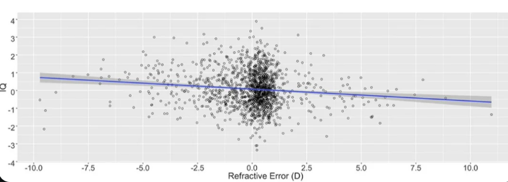

# Quiz on canvas

- Log on to the course website to take it.
- You have 10 minutes. 
- It is open notes and web. 
- Do not generate your answers with AI. 

---

# Quick Recap: Working with Git & Projects

Last time, we focused on **workflow**, not visualization.

Key ideas:
- Work inside an **R Project** (stable paths, reproducibility)
- Use **Git** to track changes over time
- Use **GitHub** to sync, submit, and recover work

The basic loop:
1. Pull updates
2. Run code
3. Make changes
4. Commit
5. Push

You are not expected to be fluent —  
you *are* expected to use this workflow consistently.


---

# Why Visualization Matters

Visualization is not decoration.

It is how we:
- Represent data
- Make comparisons possible
- Communicate arguments

Every visualization encodes choices.

---

# From Infrastructure to Representation

Previously:
- We focused on tools, projects, and reproducibility

Now:
- We focus on how data become visual objects
- And how those choices affect interpretation

---

# What Is Data (for Visualization)?

For visualization, data are:
- Variables
- Observations
- With meaning

Not all variables should be visualized the same way.

---

# Types of Variables

At a minimum, distinguish:
- Categorical variables (groups, labels)
- Quantitative variables (amounts, magnitudes)

This distinction drives visual choices.

---

# The Central Idea: Mapping

Visualization works by **mapping** data variables to visual properties.

Examples of visual properties:
- Position
- Length
- Color
- Shape
- Size

These mappings are design decisions.

---

# Quick look at mpg

```r
head(mpg)
summary(mpg[, c("displ", "hwy", "class")])
```

```{r, message=FALSE, warning=FALSE, results="asis", echo=FALSE}
library(ggplot2)
library(knitr)
library(kableExtra)

cat('<div style="font-size:60%; line-height:1.15;">')

kable(head(mpg), format = "html") %>%
  kable_styling(full_width = FALSE)

cat("<br>")

kable(summary(mpg[, c("displ", "hwy", "class")]), format = "html") %>%  # subset if you want
  kable_styling(full_width = FALSE)

cat("</div>")
```
---

# A First Example

```{r, fig.width=5, fig.height=3, message=FALSE, warning=FALSE}
ggplot(mpg, aes(x = displ, y = hwy))
```

This creates an *empty plot*.

Why?
- Data are specified
- Mappings are specified
- Nothing has been drawn yet

---

# Mapping Without Drawing

```{r, fig.width=5, fig.height=3, message=FALSE, warning=FALSE}
ggplot(mpg, aes(x = displ, y = hwy))
```

This line says:
- Engine displacement → x-position
- Highway MPG → y-position

It does *not* say how to draw the data.

---

# Adding a Visual Mark

```{r, fig.width=5, fig.height=3, message=FALSE, warning=FALSE}
ggplot(mpg, aes(x = displ, y = hwy)) +
  geom_point()
```

Now:
- Data are mapped
- A geometric object draws them

The message becomes visible.

---

# Why Position Matters

Position on a common scale is:
- The most precise visual encoding
- The easiest to compare

This is why scatterplots are so common.

---

# Defaults Are Design Choices

```{r, fig.width=5, fig.height=3, message=FALSE, warning=FALSE}
ggplot(mpg, aes(x = displ, y = hwy)) +
  geom_point()
```

Defaults decide:
- Point size
- Color
- Transparency
- Axis scales

Defaults are not neutral.

---

# Categorical Mappings

```{r, fig.width=5, fig.height=3, message=FALSE, warning=FALSE}
ggplot(mpg, aes(x = displ, y = hwy, color = class)) +
  geom_point()
```

Here:
- `class` is mapped to color
- Groups become visually distinguishable

This changes what comparisons are easy to make.

---

# Smooth trend added

```{r, fig.width=5, fig.height=3, message=FALSE, warning=FALSE}
ggplot(mpg, aes(x = displ, y = hwy, color = class)) +
  geom_point() + 
  geom_smooth()
```

Here:
- `geom_smooth` is applied
- Maybe too crowded?

---

# Mapping vs Styling

Mapping:
- Ties a variable to a visual property

Styling:
- Adjusts appearance without encoding data

This distinction matters.

---

# A Common Mistake

```{r, fig.width=5, fig.height=3, message=FALSE, warning=FALSE}
ggplot(mpg, aes(x = displ, y = hwy)) +
  geom_point(color = "blue")
```

Color here:
- Is not encoding data
- Is purely stylistic

That can be fine — but it is a choice.

---

# What a Plot Is Claiming

Every plot implicitly claims:
- What variables matter
- What relationships are important
- What comparisons are relevant

Visualization is argument by design.

---

# Data visualization critique 

- From r/dataisugly
- Take five minutes
  - What is the author conveying here?
  - What variables are mapped to what (x/y/color/size/etc.)?
  - Is it persuasive? 
  - What design choices did they make?
  - After doing this talk to your neighbor briefly and compare notes.

.center[

]

---

# From Design to Reproducibility

Visualization choices matter only if they can be revisited.

A figure becomes reproducible when:
- Design decisions are written down as code
- Mappings are explicit
- Defaults are visible
- Outputs can be regenerated

This is how visualization moves from
*an image* to *an argument*.


---

# Reproducible Visualization

Good figures are:
- Generated by code
- Saved intentionally
- Regenerated easily

No screenshots.
No manual editing.

---

# Saving a Plot

```{r, fig.width=5, fig.height=3, message=FALSE, warning=FALSE}
p <- ggplot(mpg, aes(x = displ, y = hwy)) +
  geom_point()

ggsave("scatter_example.png", plot = p)
```

The figure now:
- Exists as a file
- Can be regenerated
- Can be shared or revised

---

# Scripts, Not Console History

Plots should live in scripts:
- So decisions are visible
- So changes are traceable
- So results are reproducible

This is why projects and scripts matter.

---

# Critiquing a Visualization

When you see a plot, ask:
- What variables are mapped?
- To which visual properties?
- What message does this emphasize?
- What does it hide?

---

# In-Class Activity

Find a visualization online.

With a neighbor:
- Identify the data variables
- Identify the visual mappings
- Decide what message the plot is making
- Suggest one concrete improvement

---

# What Comes Next

Next, you will:
- Build simple plots yourself
- Practice mapping variables to aesthetics
- Write short rationales for design choices

Focus on clarity, not complexity.
