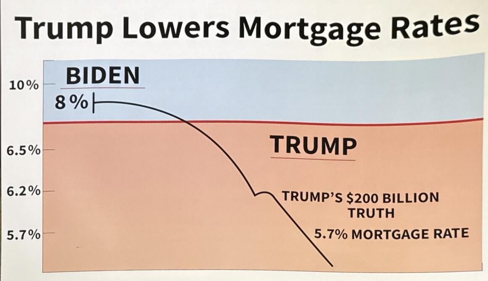
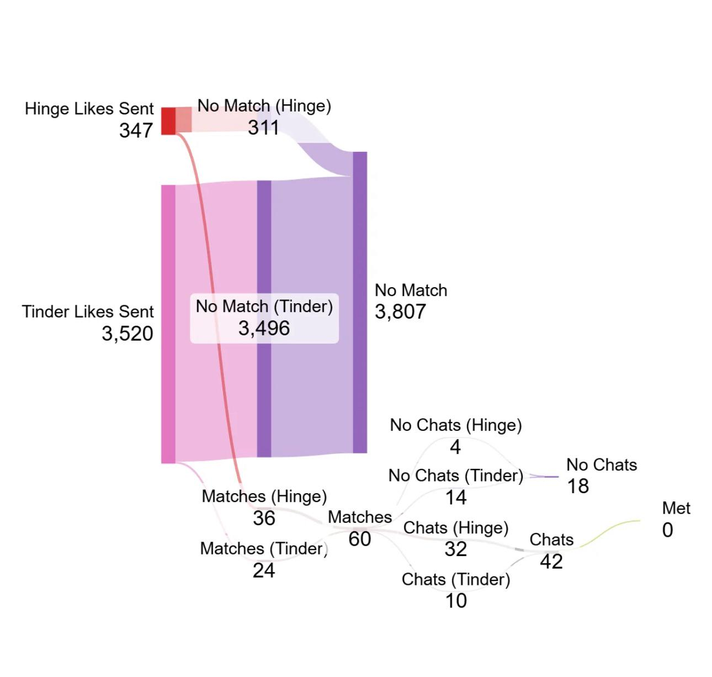
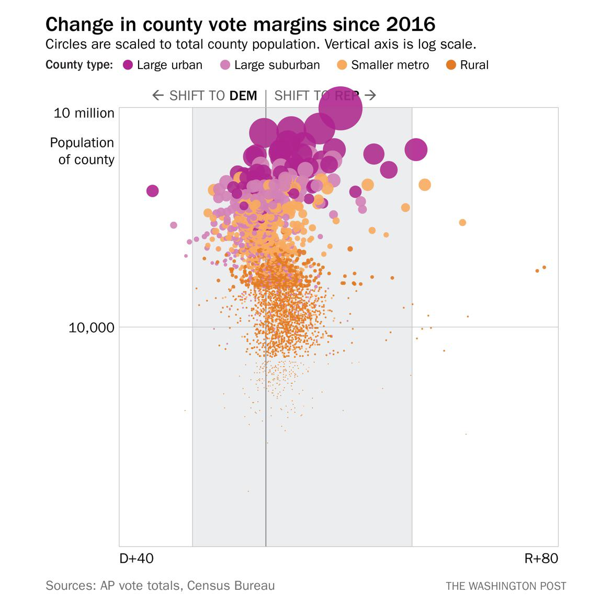

```{r setup, include=FALSE}
knitr::opts_chunk$set(
  echo = TRUE,
  message = FALSE,
  warning = FALSE
)

library(ggplot2)
library(dplyr)
```

```{r synthetic_data, include=FALSE}
# Synthetic data for demonstrating axes and transformations
# (Deliberately simple and a bit crude: early-semester friendly)

set.seed(123)

n <- 400

# Continuous variables spanning orders of magnitude (good for log discussions)
x <- 10^(runif(n, min = 0, max = 3))          # ~ 1 to 1,000
noise <- rnorm(n, mean = 0, sd = 60)

y_raw <- 2500 / sqrt(x) + noise               # decreasing curve + noise

# Keep a strictly-positive version for log scale examples
y_pos <- pmax(y_raw, 1)

# Create a version with zeros to illustrate log-scale constraints
y_with_zero <- y_pos
y_with_zero[sample(1:n, size = 20)] <- 0

# Count-like outcome for square-root scale examples
count <- rpois(n, lambda = pmax(0.5, x / 25))

# A simple categorical variable for coordinate system examples
category <- sample(c("A", "B", "C", "D"), size = n, replace = TRUE)

df_syn <- data.frame(
  x = x,
  y_pos = y_pos,
  y_with_zero = y_with_zero,
  count = count,
  category = category
)
```


# Quiz on canvas

- Log on to the course website to take it.
- You have 10 minutes. 
- It is open notes and web. 
- Do not generate your answers with AI. 

---

# Quick Recap

- What a plot is doing conceptually  
  (mapping data values to visual properties)

- The difference between:
  - **Mapping**: variables assigned inside `aes()`
  - **Styling**: fixed appearance choices outside `aes()`

- Reading plots before modifying them:
  - What variables are shown?
  - What comparisons are being encouraged?
  - What patterns are easy vs hard to see?

- Treating plots as **arguments**, not decorations  
  Every design choice implies a claim about the data.

---

#  Why this matters

- Every plot places data **somewhere**
- Position is not neutral
- Axes encode:
  - distance
  - direction
  - magnitude
  - comparison

**Core idea:**  
Changing axes can change conclusions without changing data.

---

# Coordinate systems vs scales

Two different concepts:

- **Coordinate system**
  - geometric arrangement of axes
  - how positions relate spatially
- **Scale**
  - how data values map to positions

You must know which one you are changing.

---

# The default: Cartesian coordinates

- ggplot2 defaults to Cartesian coordinates
- Two perpendicular axes:
  - x (horizontal)
  - y (vertical)
- Equal spacing = equal differences in data

This is the baseline assumption in most plots.

---

# A baseline Cartesian plot

```{r fig.width=6, fig.height=4}
ggplot(df_syn, aes(x = x, y = y_pos)) +
  geom_point()
```

**Interpretation**

- Distance on axes implies additive differences
- Visual slope reflects rate of change
- Outliers are visually meaningful

---

# Axis ranges and visibility

Axes define:

- what is visible
- what is excluded
- how crowded data appear

Changing limits changes perception.

```{r fig.width=4, fig.height=2.5, echo=FALSE}
ggplot(df_syn, aes(x = x, y = y_pos)) +
  geom_point()

```

Interpretation: 
- With a wide range, dense regions can look “flat” or “empty”
- Outliers can dominate the visible scale

---

# Cropping vs zooming (conceptual)

- Cropping removes data
- Zooming changes view without dropping data

```{r fig.width=4, fig.height=2.8}
ggplot(df_syn, aes(x = x, y = y_pos)) +
  geom_point() +
  coord_cartesian(xlim = c(250, 500), ylim = c(0, 500))
```

Interpretation: 
- Same data, different visible window
- The “main mass” is easier to see
- Outliers are still in the data (not deleted)

---

# Aspect ratios shape meaning


There is no “correct” ratio — only defensible ones.

```{r fig.width=3, fig.height=3}
ggplot(df_syn, aes(x = x, y = y_pos)) +
  geom_point() +
  coord_fixed(ratio = 1)
```

Interpretation: 
- The same data can look more/less steep
- Changing aspect ratio changes what “a slope” visually feels like

---

# Linear scales and additive thinking

On linear scales:

- Equal distance = equal difference
- 2 → 4 equals 6 → 8 visually

Linear scales are best when:
- changes are additive
- values span a narrow range

---

# Linear scales and additive thinking plot

```{r fig.width=4, fig.height=3}
ggplot(df_syn, aes(x = x, y = y_pos)) + 
  geom_point() +
  scale_x_continuous(
    breaks = seq(0, 100, by = 10),
    labels = seq(0, 100, by = 10)
    )
```

Interpretation: 
- This does not change the data
- It clarifies additive comparison by making the “unit steps” visible

---


# Data visualization critique 

- Take five minutes
  - What variables are mapped to what (x/y/color/size/etc.)?
  - Is it persuasive? 
  - What design choices did they make?
  - After doing this talk to your neighbor briefly and compare notes.

.center[

]

---

# When linear scales fail

Linear scales struggle when:

- values span orders of magnitude
- ratios matter more than differences
- large values dominate visual space

Common examples:
- population
- income
- counts
- rates

---

# Log scales: the basic idea

Log scales:

- compress large values
- expand small values
- emphasize ratios

They are useful when:
- growth is multiplicative
- proportional change matters

---

# Mapping vs styling (important)

**Mapping (data → position)**

```r
aes(x = displ, y = hwy)
```

**Styling (how positions are shown)**

```r
scale_x_log10(); scale_y_log10()
```

A log scale does **not** change the data.

---

# Linear vs log scale (same data)

```{r fig.width=6, fig.height=4}
ggplot(df_syn, aes(x = x, y = y_pos)) +
  geom_point() +
  scale_x_log10()
```

**Interpretation**

- Relative differences are easier to compare
- Small values gain visual resolution
- Absolute distances are no longer additive

---


# Data visualization critique 

- Take five minutes
  - What variables are mapped to what (x/y/color/size/etc.)?
  - Is it persuasive? 
  - What design choices did they make?
  - After doing this talk to your neighbor briefly and compare notes.

.center[

]

---

# Reading a log axis

On a log scale:

- Equal spacing = equal ratios
- Moving one tick = multiplication, not addition

This increases cognitive load.

Use only when the benefit outweighs the cost.

---

# Zero and log scales

Log scales cannot display:

- zero
- negative values

This is a mathematical constraint, not a software issue.

If zeros exist:
- log scales may mislead
- data may silently drop

---

# Transforming data vs transforming scales

Two different approaches:

1. Transform the data
2. Transform the scale

They look similar but imply different interpretations.

---

# Example: transforming the data

```{r fig.width=6, fig.height=4}
df_syn <- df_syn %>%
  mutate(log_x = log10(x))

ggplot(df_syn, aes(x = log_x, y = y_pos)) +
  geom_point()
```

Now the **data themselves** are logged.

---

# Why this distinction matters

- Scale transforms preserve original units
- Data transforms redefine variables
- Labels and interpretation must follow the choice

Always be explicit.

---

# Ratios and multiplicative processes

Log scales are often appropriate for:

- ratios
- growth rates
- relative change

On a log scale:
- 1 is a natural midpoint
- values above and below are symmetric multiplicatively

---


# Data visualization critique 

- Take five minutes
  - What variables are mapped to what (x/y/color/size/etc.)?
  - Is it persuasive? 
  - What design choices did they make?
  - After doing this talk to your neighbor briefly and compare notes.

.center[

]

---

# Square-root scales (conceptual)

Square-root scales:

- compress large values
- retain zero
- are less aggressive than logs

Often useful for:
- counts
- area-like quantities

They trade interpretability for flexibility.

---

# Square-root scales plot

```{r fig.width=4, fig.height=3}
ggplot(df_syn, aes(x = x, y = count)) +
  geom_point() +
  scale_x_log10() +
  scale_y_sqrt()
```

**Interpretation**

- Square-root reduces the dominance of very large counts
- Zeros are still shown
- Comparisons become “less extreme” visually

---

# Coordinate systems beyond Cartesian

Scales transform values  
Coordinates transform geometry

Examples:
- Cartesian (default)
- Polar (circular axes)

These are **not** cosmetic changes.

---

# Polar coordinates (use with caution)

Polar coordinates:

- map x to angle
- map y to radius

They emphasize cyclic structure  
They obscure precise comparison.

---

# Polar coordinates plot

```{r fig.width=4, fig.height=3}
df_polar <- df_syn %>%
  group_by(category) %>%
  summarise(total = sum(count)) %>%
  arrange(category)

ggplot(df_polar, aes(x = category, y = total)) +
  geom_col() +
  coord_polar()
```

Interpretation:
- Same bars as a standard bar chart, but wrapped into a circle
- Visually striking, but harder to compare lengths precisely

---

# Why polar plots are risky

- Length comparisons become angle comparisons
- Area distortions are common
- Many “pie charts” misuse polar coordinates

Use only when:
- circular structure is substantively meaningful

---

# Data must be plot-ready

Before plotting, data often need:

- filtering
- summarizing
- rate calculation
- unit alignment

Plotting does not fix bad structure.

---

# Minimal reproducible workflow

A basic habit:

1. Load data
2. Prepare variables
3. Plot
4. Save output

```{r}
dir.create("figures", showWarnings = FALSE)
p <- ggplot(df_syn, aes(x = x, y = y_pos)) +
  geom_point() +
  scale_x_log10()

ggsave(
  filename = "figures/engine_mpg_log.png",
  plot = p,
  width = 6,
  height = 4
)
```

---

# What success looks like

- You can explain:
  - why a scale was chosen
  - what it emphasizes and hides
- You can identify:
  - coordinate changes vs scale changes
- Your script runs top-to-bottom
- Outputs save without manual steps

---

# In-Class Activity

Find a visualization online.

With a neighbor:
- Identify the data variables
- Identify the visual mappings
- Decide what message the plot is making
- Suggest one concrete improvement

---

# What Comes Next

Next, you will:
- Build simple plots yourself
- Practice mapping variables to aesthetics
- Write short rationales for design choices

Focus on clarity, not complexity.

