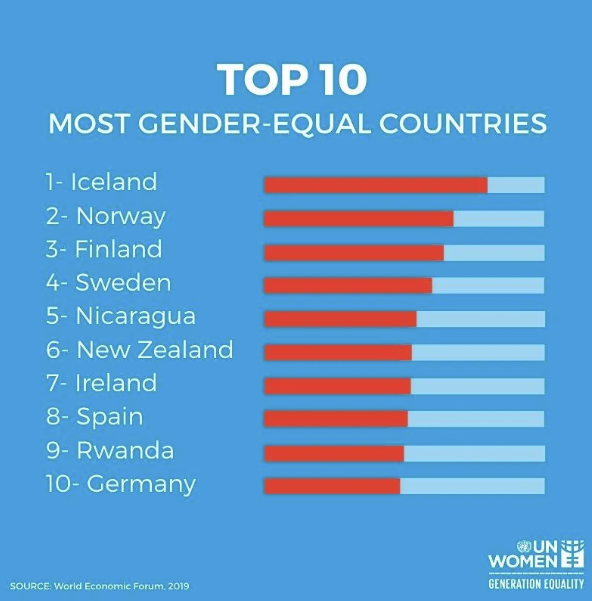
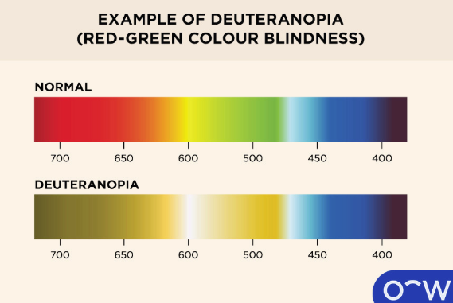

class: center, middle, inverse, title-slide

.title[
# Color as Encoding, Highlighting, and Error
]
.subtitle[
## How color communicates, misleads, and persuades
]
.author[
### Jared Edgerton
]

---

# Quiz on canvas

- Log on to the course website to take it.
- You have 10 minutes.
- It is open notes and web.
- Do not generate your answers with AI.

---

# Quick Recap

- Axes and scales encode meaning
- Visual differences imply claims about the data
- Mapping vs styling:
  - **Mapping** = data → visual property
  - **Styling** = fixed appearance
- Transformations can clarify or distort

---

# Why color deserves special care

- Color is powerful and immediate
- It draws attention before shape or position
- Misused color can:
  - obscure patterns
  - create false distinctions
  - overwhelm the reader

**Core idea:**  
Color should serve a purpose, not decorate.

---

# Setup

```{r, message=FALSE, warning=FALSE}
library(ggplot2)
library(dplyr)

set.seed(123)
```

---

# Synthetic data for today

We create data where color choices matter.

```{r}
n <- 600

df_color <- data.frame(
  id = 1:n,
  group = sample(c("A", "B", "C", "D"), n, replace = TRUE),
  x = rnorm(n),
  y = rnorm(n)
)

df_color <- df_color %>%
  mutate(
    value = exp(0.7 * x + rnorm(n, sd = 0.4)),
    delta = (x - y) * 10
  )
```

---

# Synthetic data for today


```{r}
summary(df_color)
```

---

# Mapping vs styling (color)

**Mapping**

```r
aes(color = group)
aes(color = value)
```

**Styling**

```r
geom_point(color = "steelblue")
```

Color only encodes information when it is mapped.

---

# Color to distinguish categories

Goal:
- separate groups with no order

```{r fig.width=7, fig.height=4}
ggplot(df_color, aes(x = x, y = y, color = group)) +
  geom_point()
```

---

# Categorical color: intervention

```{r fig.width=7, fig.height=4}
ggplot(df_color, aes(x = x, y = y, color = group)) +
  geom_point() +
  scale_color_brewer(palette = "Dark2")
```

Interpretation:
- Colors are distinct
- No implied ranking

---

# Too many colors (problem)

When categories grow:

- matching legend ↔ points becomes hard
- color stops helping

**Rule of thumb:**  
Beyond ~6–8 categories, reconsider color.

---

# Color to represent magnitude

Goal:
- show how large values are

```{r fig.width=7, fig.height=4}
ggplot(df_color, aes(x = x, y = y, color = value)) +
  geom_point()
```

---

# Sequential color scale

```{r fig.width=7, fig.height=4}
ggplot(df_color, aes(x = x, y = y, color = value)) +
  geom_point() +
  scale_color_gradient(low = "lightgray", high = "blue")
```

Interpretation:
- Darker = larger
- Order is visually clear

---

# Skewed values and compression

Most values are small.
A few are large.

Result:
- many points look the same color

---

# Fix: transform before coloring

```{r}
df_color <- df_color %>%
  mutate(log_value = log10(value))
```

```{r fig.width=7, fig.height=4}
ggplot(df_color, aes(x = x, y = y, color = log_value)) +
  geom_point() +
  scale_color_gradient(low = "lightgray", high = "blue") +
  labs(color = "log10(value)")
```

---

# Diverging color scales

Use when:
- a midpoint matters

```{r fig.width=7, fig.height=4}
ggplot(df_color, aes(x = x, y = y, color = delta)) +
  geom_point()
```

---

# Diverging scale with midpoint

```{r fig.width=7, fig.height=4}
ggplot(df_color, aes(x = x, y = y, color = delta)) +
  geom_point() +
  scale_color_gradient2(
    low = "red",
    mid = "white",
    high = "blue",
    midpoint = 0
  ) +
  labs(color = "Difference from zero")
```

---

# Highlighting vs encoding

Highlighting:
- draws attention
- does not encode full variation

```{r}
df_color <- df_color %>%
  mutate(highlight = ifelse(value > quantile(value, 0.95), "HIGHLIGHT", "BASE"))
```

---

# Highlighting example

```{r fig.width=7, fig.height=4}
ggplot(df_color, aes(x = x, y = y, color = highlight)) +
  geom_point() +
  scale_color_manual(values = c("BASE" = "gray70", "HIGHLIGHT" = "red")) +
  labs(color = "")
```

---

# Highlighting with redundancy

```{r fig.width=4, fig.height=3}
ggplot(df_color, aes(x = x, y = y)) +
  geom_point(color = "gray70") +
  geom_point(
    data = df_color %>% filter(highlight == "HIGHLIGHT"),
    color = "red",
    size = 2
  )
```

Interpretation:
- Color + size reinforce the message

---


# Data visualization critique 

- Take five minutes
  - What variables are mapped to what (x/y/color/size/etc.)?
  - Is it persuasive? 
  - What design choices did they make?
  - After doing this talk to your neighbor briefly and compare notes.

.center[

]


---


# Altering the background (black white)

```{r fig.width=7, fig.height=4}
ggplot(df_color, aes(x = x, y = y, color = delta)) +
  geom_point() +
  scale_color_gradient2(
    low = "red",
    mid = "white",
    high = "blue",
    midpoint = 0
  ) +
  labs(color = "Difference from zero") + 
  theme_bw()
```

---


# Altering the background (classic)

```{r fig.width=7, fig.height=4}
ggplot(df_color, aes(x = x, y = y, color = delta)) +
  geom_point() +
  scale_color_gradient2(
    low = "red",
    mid = "white",
    high = "blue",
    midpoint = 0
  ) +
  labs(color = "Difference from zero") + 
  theme_classic()
```

---


# Altering the background (minimal)

```{r fig.width=7, fig.height=4}
ggplot(df_color, aes(x = x, y = y, color = delta)) +
  geom_point() +
  scale_color_gradient2(
    low = "red",
    mid = "white",
    high = "blue",
    midpoint = 0
  ) +
  labs(color = "Difference from zero") + 
  theme_minimal()
```

---


# Altering the background (black)

```{r fig.width=7, fig.height=4}
ggplot(df_color, aes(x = x, y = y, color = delta)) +
  geom_point() +
  scale_color_gradient2(
    low = "red",
    mid = "white",
    high = "blue",
    midpoint = 0
  ) +
  labs(color = "Difference from zero") + 
  theme_dark()
```

---


# Data visualization critique 

- Take five minutes
  - What variables are mapped to what (x/y/color/size/etc.)?
  - Is it persuasive? 
  - What design choices did they make?
  - After doing this talk to your neighbor briefly and compare notes.

.center[

]

---

# Color theory (perception basics)

Key ideas:
- **Lightness** matters more than hue for ordered data
- Perception is **not linear** (equal numeric steps may not “look” equal)
- Color can imply structure that is not there (false boundaries, “hot spots”)

Practical rule:
- If you want viewers to read **order**, use a palette with a clear light → dark progression.

---

# ColorBrewer palettes 

Below are three common palettes from ColorBrewer:

- **Set2** (categorical; no order implied)
- **Dark2** (categorical; no order implied)
- **Blues** (sequential; ordered)
- **RdBu** (diverging; midpoint implied)

```{r fig.width=7, fig.height=4, echo=FALSE, warning=FALSE, message=FALSE, echo=FALSE}
library(RColorBrewer)
pal_df <- data.frame(
  palette = c(rep("Set2 (categorical)", 8),
              rep("Dark2 (categorical)", 8),
              rep("Blues (sequential)", 9),
              rep("RdBu (diverging)", 11)),
  color = c(brewer.pal(8, "Set2"),
            brewer.pal(8, "Dark2"),
            brewer.pal(9, "Blues"),
            brewer.pal(11, "RdBu")),
  idx = c(1:8, 1:8, 1:9, 1:11)
)

```

```{r fig.width=6, fig.height=5, echo=FALSE}
ggplot(pal_df, aes(x = idx, y = palette, fill = color)) +
  geom_tile() +
  scale_fill_identity() +
  labs(x = "", y = "") +
  theme(
    axis.text.x = element_blank(),
    axis.ticks.x = element_blank()
  ) + 
  theme_classic()
```

---

# Rainbow palettes (why to avoid)

- Non-monotonic
- Uneven perceptual jumps
- Create artificial boundaries

Avoid unless you have a strong reason.

```{r, fig.width=7, fig.height=4, echo=FALSE}
rain_df <- data.frame(
  idx = 1:60,
  color = hcl(
    h = seq(0, 360, length.out = 60),
    c = 100,
    l = 65
  )
)

ggplot(rain_df, aes(x = idx, y = 1, fill = color)) +
  geom_tile() +
  scale_fill_identity() +
  labs(x = "", y = "") +
  theme(
    axis.text = element_blank(),
    axis.ticks = element_blank(),
    panel.grid = element_blank()
  ) + 
  theme_classic()
```

---

# Complementary colors (pairs)

When you have **paired** values (A vs B), complementary colors can help you compare.

Goal:
- two colors with strong contrast
- similar lightness so neither “wins”

```{r fig.width=7, fig.height=3, echo=FALSE}
pair_df <- data.frame(
  pair = rep(c("Pair 1", "Pair 2", "Pair 3", "Pair 4"), each = 2),
  side = rep(c("A", "B"), times = 4),
  color = c("#1f77b4", "#ff7f0e",   # blue / orange
            "#2ca02c", "#d62728",   # green / red (high risk for CVD)
            "#9467bd", "#bcbd22",   # purple / olive
            "#17becf", "#e377c2")   # cyan / magenta
)

ggplot(pair_df, aes(x = side, y = pair, fill = color)) +
  geom_tile() +
  scale_fill_identity() +
  labs(x = "", y = "") +
  theme(
    axis.text.x = element_text(size = 14),
    panel.grid = element_blank()
  ) + 
  theme_classic()
```

Interpretation:

- Complementary pairs increase **separation**
- Avoid red/green as a default (often fails for color-vision deficiency)


---

# Accessibility basics

- Some readers cannot distinguish red/green
- Small colored elements are harder to see
- No palette is universally safe

**Practical defaults:**
- limit colors
- use redundancy
- label clearly

.center[

]

---

# What success looks like

- You can say why a color scale was chosen
- You can distinguish encoding vs highlighting
- You can identify misleading color use

---

# In-Class Activity

Find a visualization online.

With a neighbor:
- Identify the data variables
- Identify the visual mappings
- Decide what message the plot is making
- Suggest one concrete improvement

---

# What Comes Next

Next, you will:
- Design color scales in code
- Practice highlighting vs encoding
- Check plots for accessibility

Focus on clarity, not complexity.
