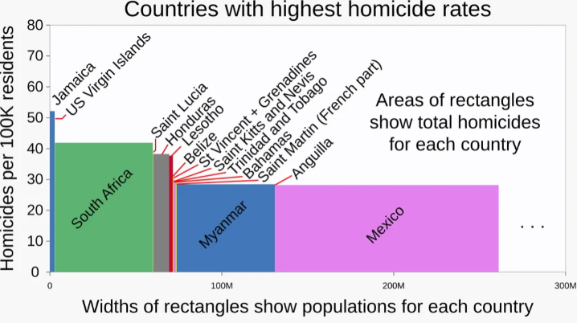
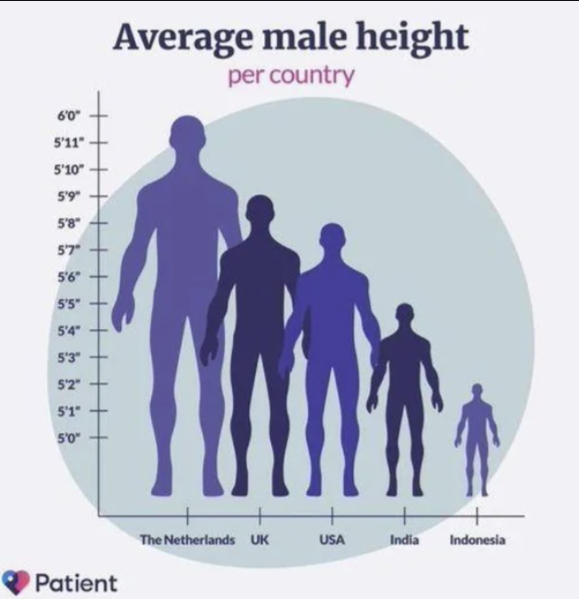

class: center, middle, inverse, title-slide

.title[
# Choosing Visualizations, Proportional Ink, and Tidy Data
]
.subtitle[
## Matching questions to plots and shaping data for ggplot
]
.author[
### Jared Edgerton
]

---

# Quiz on canvas

- Log on to the course website to take it.
- You have 10 minutes.
- It is open notes and web.
- Do not generate your answers with AI.

---

# Quick Recap

- Color has different jobs:
  - **distinguish categories**
  - **represent magnitude**
  - **highlight**
- Mapping vs styling:
  - **Mapping** = data → visual property (`aes(...)`)
  - **Styling** = fixed appearance
- Common pitfalls:
  - too many categories
  - rainbow palettes
  - color choices that hide the message
- Accessibility basics:
  - limit colors
  - use redundancy
  - label clearly

---

# Why this matters

A plot is a choice about:

- what question you are answering
- what comparisons you want the reader to make
- what you are willing to hide

**Core idea:**  
Choose the visualization based on the task, not on habit.

---

# Setup

```{r, message=FALSE, warning=FALSE}
library(ggplot2)
library(dplyr)
library(tidyr)

set.seed(123)
```

---

# Simulate several “plot-ready” datasets


```{r}
df_amounts <- data.frame(
  category = c("A", "B", "C", "D", "E"),
  value = c(18, 34, 12, 27, 41))
df_dist <- data.frame(
  group = sample(c("Control", "Treatment"), 400, replace = TRUE),
  outcome = rnorm(400, mean = ifelse(sample(c("Control","Treatment"), 400, replace=TRUE)=="Treatment", 0.4, 0), sd = 1))
df_props <- data.frame(
  segment = c("X", "Y", "Z"),
  count = c(30, 15, 5)) %>%
  mutate(prop = count / sum(count))
df_xy <- data.frame(
  x = runif(30, 0, 10)) %>%
  mutate(y = 2 + 0.6 * x + rnorm(30, sd = 1.2))
df_time <- data.frame(
  t = 1:50,
  y = 10 + 0.15 * 1:50 + rnorm(length(50), sd = 1.0))
df_unc <- data.frame(
  label = c("A","B","C","D","E"),
  est = c(0.2, 0.5, 0.35, 0.6, 0.4),
  lo = c(0.1, 0.35, 0.2, 0.45, 0.25),
  hi = c(0.3, 0.65, 0.5, 0.75, 0.55))
```

---

# A quick “directory” of visualization tasks

Most plots you will make fall into one of these tasks:

- **Amounts**: how much? (category → value)
- **Distributions**: how are values spread?
- **Proportions**: parts of a whole
- **Relationships**: how does y change with x?
- **Time**: change across time
- **Uncertainty**: how precise is an estimate?

---

# Amounts: bar chart (baseline)

Use when:
- you want to compare magnitudes across categories

```{r fig.width=7, fig.height=4}
ggplot(df_amounts, aes(x = category, y = value)) +
  geom_col() + 
  theme_classic()
```

---

# Amounts: dot plot (often cleaner)

A dot plot encodes value by position, not area.

```{r fig.width=7, fig.height=4}
ggplot(df_amounts, aes(x = value, y = category)) +
  geom_point(size = 3) + 
  theme_classic()
```

Interpretation:
- easier endpoint comparison
- less ink

---

# Amounts: ordering matters

When categories are unordered, default order can hide comparisons.

```{r fig.width=7, fig.height=4}
df_amounts_ord <- df_amounts %>%
  arrange(value) %>%
  mutate(category = factor(category, levels = category))

ggplot(df_amounts_ord, aes(x = category, y = value)) +
  geom_col() + 
  theme_classic()
```

---

# Distributions: histogram (baseline)

Use when:
- you need to understand shape (skew, multimodality)

```{r fig.width=7, fig.height=4}
ggplot(df_dist, aes(x = outcome)) +
  geom_histogram(bins = 30) + 
  theme_classic()
```

---

# Histograms and bin size choices

A histogram requires a choice:
- how wide each bin should be
- how many bins to use

These choices affect:
- perceived smoothness
- apparent modes
- where “peaks” appear

---

# Default histogram (ggplot decides)

```{r fig.width=7, fig.height=4}
ggplot(df_dist, aes(x = outcome)) +
  geom_histogram() +
  theme_classic()
```

Interpretation:

* ggplot chooses a bin width automatically
* This is reasonable as a **first look**
* You should not treat it as a final answer

---

# Explicit bin choice (you decide)

```{r fig.width=7, fig.height=4}
ggplot(df_dist, aes(x = outcome)) + 
  geom_histogram(bins = 30) +
  theme_classic()
```

Interpretation:

* The data are unchanged
* Only the aggregation has changed
* Apparent “shape” can look different

---

# Why this matters

* Too few bins:

  * hides structure
  * oversmooths the distribution
* Too many bins:

  * creates noise
  * suggests false irregularity

**Rule of thumb:**
Use the default to explore, then justify your bin choice.

---

# Distributions: compare groups (boxplot)

Use when:
- you care about differences in typical values and spread

```{r fig.width=7, fig.height=4}
ggplot(df_dist, aes(x = group, y = outcome)) +
  geom_boxplot() + 
  theme_classic()
```

---

# Boxplots (what they show)

A boxplot summarizes a distribution using **five key quantities**:

- median (center line)
- 25th percentile (bottom of box)
- 75th percentile (top of box)
- lower whisker (typical minimum)
- upper whisker (typical maximum)

Points beyond the whiskers are shown as **potential outliers**.

---

# What boxplots are good for

- Comparing **distributions across groups**
- Seeing differences in:
  - central tendency
  - spread
  - asymmetry
- Compact summaries when you have many groups

---

# What boxplots hide

- Exact distribution shape
- Multimodality
- Individual observations (except outliers)

**Key idea:**  
Boxplots trade detail for comparability.

---

# Proportions: bars are usually clearer than pies

Bars make comparison easier than angles or areas.

```{r fig.width=7, fig.height=4}
ggplot(df_props, aes(x = segment, y = prop)) +
  geom_col()  + 
  theme_classic()
```


---


# Proportions: pie chart (for critique)

Pie charts encode by angle/area, which is hard to compare precisely.

```{r fig.width=6, fig.height=4}
ggplot(df_props, aes(x = "", y = prop, fill = segment)) +
  geom_col(width = 1) +
  coord_polar(theta = "y") +
  labs(x = "", y = "") +
  theme(axis.text = element_blank(), axis.ticks = element_blank()) + 
  theme_classic()
```

---

# Relationships: scatterplot

Use when:
- you want to see association + outliers + nonlinearity

```{r fig.width=7, fig.height=4}
ggplot(df_xy, aes(x = x, y = y)) +
  geom_point() + 
  theme_classic()
```

---


# Data visualization critique 

- Take five minutes
  - What variables are mapped to what (x/y/color/size/etc.)?
  - Is it persuasive? 
  - What design choices did they make?
  - After doing this talk to your neighbor briefly and compare notes.

.center[

]

---

# Time: line plot (minimal)

Use when:
- x is time (ordered)
- you want to show evolution

```{r fig.width=7, fig.height=4}
ggplot(df_time, aes(x = t, y = y)) +
  geom_smooth(method = "lm") +
  geom_point() + 
  theme_classic()
```

---

# Uncertainty: points with error bars

Use when:
- you want to show an estimate and its range

```{r fig.width=7, fig.height=4}
ggplot(df_unc, aes(x = label, y = est)) +
  geom_point(size = 2) +
  geom_errorbar(aes(ymin = lo, ymax = hi), width = 0.2) + 
  theme_classic()
```


---


# The principle of proportional ink

A visualization should not exaggerate differences by accident.

Key idea:
- the visual “ink” used to represent a value should be proportional to that value

Most common violation:
- truncating a bar axis

---

# Proportional ink: misleading truncated bar axis

This makes differences look larger than they are.

```{r fig.width=7, fig.height=3.5}
ggplot(df_amounts, aes(x = category, y = value)) +
  geom_col() +
  coord_cartesian(ylim = c(30, 45)) + 
  theme_classic()
```

---

# Proportional ink: correct baseline (bars start at zero)

```{r fig.width=7, fig.height=3.5}
ggplot(df_amounts, aes(x = category, y = value)) +
  geom_col() + 
  theme_classic()
```

Interpretation:
- same data
- different implied magnitude

---

# When not to use bars

Bars are a bad choice when:

- the axis is logarithmic (length no longer proportional to value)
- you only need ranked comparison (dots can be cleaner)
- you have too many categories (labels become the bottleneck)

---


# Data visualization critique 

- Take five minutes
  - What variables are mapped to what (x/y/color/size/etc.)?
  - Is it persuasive? 
  - What design choices did they make?
  - After doing this talk to your neighbor briefly and compare notes.

.center[

]

---

# Pie charts and area distortions

Pie charts often violate proportional thinking because:

- we judge angles and areas poorly
- small differences are hard to detect

If magnitude matters:
- prefer bars or dots

---

# Proportions: waffle plot (contrast to pie)

A waffle plot shows proportions as **counts of equal tiles**.
It makes “how many” more concrete than angles.

```{r fig.width=4, fig.height=3, warning=FALSE, message=FALSE}
library(waffle)
waffle_counts <- setNames(
  round(df_props$prop * 100),
  df_props$segment)
waffle_counts[1] <- waffle_counts[1] + (100 - sum(waffle_counts))
waffle::waffle(waffle_counts, rows = 10, size = 0.6) +
  theme_classic()
```

---


# Tidy data: the prerequisite for plotting

To make ggplot work smoothly, your data should be “tidy”:

- each variable is a column
- each observation is a row
- each value is a cell

---

# Wide vs long (simple example)

Wide format (harder for many ggplot tasks):

```{r}
df_wide <- data.frame(
  id = c("A","B","C"),
  bp1 = c(100, 140, 120),
  bp2 = c(110, 115, 125)
)

df_wide
```

---

# Pivot longer (make it tidy)

```{r}
df_long <- df_wide %>%
  pivot_longer(
    cols = c(bp1, bp2),
    names_to = "measurement",
    values_to = "value"
  )

df_long
```

---

# Plot after tidying (mapping becomes simple)

```{r fig.width=4, fig.height=3}
ggplot(df_long, aes(x = measurement, y = value, group = id)) +
  geom_point() +
  geom_line() + 
  theme_classic()
```

Interpretation:
- the plot becomes easy because the data are structured for it

---

# Pivot wider (when you need one row per unit)

Sometimes you want one row per unit again.

```{r}
df_wide_again <- df_long %>%
  pivot_wider(
    names_from = measurement,
    values_from = value
  )

df_wide_again
```

---

# A practical rule

If you feel like ggplot is “fighting you,” it usually means:

- your data are not tidy
- or you have not defined the question clearly

Fix the structure before you fix the plot.

---

# In-person data visualization example

We will pause here and look at a real visualization.

Focus on:

- what question it seems to answer
- whether the visual encoding is proportional
- whether the data structure is clear from the plot

---

# What success looks like

- You can identify the task:
  - amounts, distributions, proportions, relationships, time, uncertainty
- You can justify a plot choice for a question
- You can spot a proportional-ink violation
- You can tidy a simple dataset for plotting

---

# In-Class Activity


Find a visualization online.

With a neighbor:
- Identify the data variables
- Identify the visual mappings
- Decide what message the plot is making
- Suggest one concrete improvement

---

# What Comes Next

Next, you will:
- reshape (tidy) data for plotting
- choose a plot type based on the question
- practice avoiding proportional-ink mistakes

Focus on clarity, not complexity.
