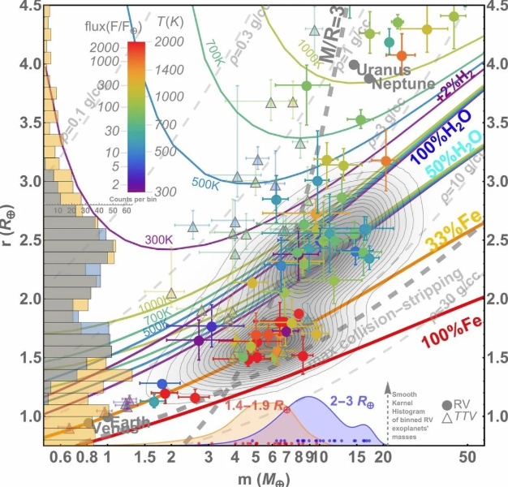
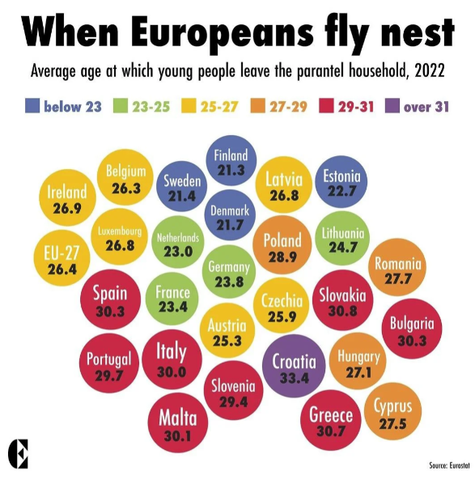

class: center, middle, inverse, title-slide

.title[
# Distributions, Overplotting, and ggplot Layers
]
.subtitle[
## Binning, smoothing, and seeing the data you actually have
]
.author[
### Jared Edgerton
]

---

class: center, middle, inverse, title-slide

.title[
# Distributions, Overplotting, and ggplot Layers
]
.subtitle[
## Binning, smoothing, and seeing the data you actually have
]
.author[
### Jared Edgerton
]

---

# Quiz on canvas

- Log on to the course website to take it.
- You have 10 minutes.
- It is open notes and web.
- Do not generate your answers with AI.

---

# Quick Recap

- Choosing a plot is choosing a task:
  - **amounts**, **distributions**, **proportions**, **relationships**, **time**, **uncertainty**
- Proportional ink:
  - bar axes should start at zero (unless there is a strong reason not to)
- Tidy data supports plotting:
  - variables = columns
  - observations = rows
  - values = cells

---

# Why this matters

A distribution plot is a choice about:

- what structure you want to reveal
- what noise you are willing to suppress
- what comparisons you want the reader to make

**Core idea:**  
Binning and smoothing are modeling decisions.

---

# Setup

```{r, message=FALSE, warning=FALSE}
library(ggplot2)
library(dplyr)
library(tidyr)

set.seed(123)
```

---

# Simulate one dataset for lecture

We will reuse this one dataset for: (a) 1-variable distributions (histogram, density), (b) distribution comparisons by group, (c) overlap in scatterplots (alpha, jitter, binning), and (d) layered ggplot patterns (stats + position)

```{r}
df <- data.frame(
  id = 1:1200,
  group = sample(c("Control", "Treatment"), 1200, replace = TRUE),
  segment = sample(c("X", "Y", "Z"), 1200, replace = TRUE, prob = c(0.55, 0.30, 0.15)))
df <- df %>%
  mutate(
    outcome = rnorm(1200, mean = ifelse(group == "Treatment", 0.35, 0), sd = 1),
    outlier_flag = rbinom(1200, 1, 0.02),
    outcome = ifelse(outlier_flag == 1, outcome + rnorm(1200, mean = 5, sd = 0.5), outcome),
    x = rnorm(1200, mean = ifelse(group == "Treatment", 0.4, 0), sd = 1),
    x_round = round(x, 1),
    y = 1.5 + 0.7 * x + ifelse(group == "Treatment", 0.4, 0) + rnorm(1200, sd = 0.9),
    y_round = round(y, 1))
```

---

# A quick “directory” of today's decisions

We will make three kinds of representational choices:

- **Binning** (histograms)
- **Smoothing** (density)
- **Visibility** (overlap handling)

Then we connect those to ggplot mechanics:

- **Mapping** vs **styling**
- **Statistical transformations** vs **position adjustments**

---

# Distributions: histogram (baseline)

Use when:
- you want to see *shape* (skew, tails, multimodality)

```{r, fig.width=7, fig.height=4}
ggplot(df, aes(x = outcome)) +
  geom_histogram(bins = 30) +
  theme_classic()
```

---

# Histograms require a choice

A histogram requires a choice:

- how many bins (or the bin width)

These choices affect:

- perceived smoothness
- apparent modes
- how "peaky" the distribution looks

---

# Same data, fewer bins

```{r, fig.width=7, fig.height=4}
ggplot(df, aes(x = outcome)) +
  geom_histogram(bins = 15) +
  theme_classic()
```

Interpretation:
- smoother look
- can hide secondary structure

---

# Same data, more bins

```{r, fig.width=7, fig.height=4}
ggplot(df, aes(x = outcome)) +
  geom_histogram(bins = 60) +
  theme_classic()
```

Interpretation:
- more detail
- can make noise look like structure

---

# What can go wrong with bins?

- Too few bins:
  - hides structure
  - merges distinct subgroups into one lump
- Too many bins:
  - creates noise
  - suggests false irregularity

**Practical habit:**  
Try at least two bin choices before deciding.

---

# Distributions: density plot (baseline)

A density plot is a smoothed estimate of the distribution.

```{r, fig.width=7, fig.height=4}
ggplot(df, aes(x = outcome)) +
  geom_density() +
  theme_classic()
```

---

# Density requires a choice

A density plot requires a choice:

- the smoothing bandwidth  
  (in ggplot, controlled by `adjust`)

Interpretation changes with smoothing:
- too smooth → hides structure
- too wiggly → suggests structure that isn't there

---

# Same data, less smoothing (wigglier)

```{r, fig.width=7, fig.height=4}
ggplot(df, aes(x = outcome)) +
  geom_density(adjust = 0.6) +
  theme_classic()
```

Interpretation:
- can reveal real bumps
- can also invent bumps from noise

---

# Same data, more smoothing (smoother)

```{r, fig.width=7, fig.height=4}
ggplot(df, aes(x = outcome)) +
  geom_density(adjust = 1.8) +
  theme_classic()
```

Interpretation:
- stable summary
- can erase meaningful structure

---

# Density pitfall to watch for

A density curve can suggest probability mass where data are impossible.

Examples:
- negative values for quantities that can't be negative
- density "bleeding" past natural bounds

**Rule:**  
If bounds matter, check them explicitly (or transform the variable).

---

# Comparing distributions across groups

Two different questions:

- Are group distributions shaped differently?
- Are group totals different?

We will focus on *shape* first.

---

# Compare groups: overlapped densities

```{r, fig.width=7, fig.height=4}
ggplot(df, aes(x = outcome, color = group)) +
  geom_density(linewidth = 1) +
  theme_classic()
```

Interpretation:
- good for **a few groups**
- focuses on **shape**

---

# Compare groups: densities with fill

```{r, fig.width=7, fig.height=4}
ggplot(df, aes(x = outcome, fill = group)) +
  geom_density(alpha = 0.35) +
  theme_classic()
```

Pitfall:
- too many groups → muddy overlap

---

# Compare groups: small multiples

```{r, fig.width=7, fig.height=4}
ggplot(df, aes(x = outcome)) +
  geom_histogram(bins = 30) +
  facet_wrap(~ group) +
  theme_classic()
```

Interpretation:
- easy comparisons
- avoids color overload

---

# Pause and discuss with a neighbor

You have two distribution designs:

1) overlapped densities  
2) faceted histograms

**Prompt:**
- Which one would you choose for a skeptical reader?
- What question is each one better at answering?

---


# Data visualization critique 

- Take five minutes
  - What variables are mapped to what (x/y/color/size/etc.)?
  - Is it persuasive? 
  - What design choices did they make?
  - After doing this talk to your neighbor briefly and compare notes.

.center[

]

---

# From distributions to overlap

Now we move from one variable to two:

- distributions become *clouds of points*
- overlap hides data
- your choices determine what becomes visible

---

# Overplotting: the baseline scatterplot

```{r, fig.width=7, fig.height=4}
ggplot(df, aes(x = x_round, y = y_round)) +
  geom_point() +
  theme_classic()
```

Interpretation:
- many points are *invisible* because they are on top of each other

---

# Fix 1: transparency (alpha)

```{r, fig.width=7, fig.height=4}
ggplot(df, aes(x = x_round, y = y_round)) +
  geom_point(alpha = 0.15, size = 2) +
  theme_classic()
```

Interpretation:
- darker regions indicate higher density
- works well when overlap is moderate

---

# Fix 2: jitter (separate tied points)

```{r, fig.width=7, fig.height=4}
ggplot(df, aes(x = x_round, y = y_round)) +
  geom_point(alpha = 0.15, position = position_jitter(width = 0.08, height = 0.08)) +
  theme_classic()
```

Pitfall:
- too much jitter creates fake precision

---

# Fix 3: 2D binning (summarize density)

```{r, fig.width=7, fig.height=4}
ggplot(df, aes(x = x_round, y = y_round)) +
  geom_bin2d() +
  theme_classic()
```

Interpretation:
- position becomes a bin
- fill encodes how many points fall into each bin

---

# Fix 4: density contours

```{r, fig.width=7, fig.height=4}
ggplot(df, aes(x = x, y = y)) +
  geom_point(alpha = 0.08) +
  geom_density_2d(linewidth = 0.7) +
  theme_classic()
```

Interpretation:
- contours show *regions of similar point density*
- nice for describing the "shape" of the cloud

---

# A quick critique habit for overlap

If a scatterplot looks "clean" but the dataset is large:

- ask whether overlap is being hidden
- try alpha or 2D binning as a diagnostic
- consider facets if group comparisons are the goal

---


# Data visualization critique 

- Take five minutes
  - What variables are mapped to what (x/y/color/size/etc.)?
  - Is it persuasive? 
  - What design choices did they make?
  - After doing this talk to your neighbor briefly and compare notes.

.center[

]

---

# ggplot layers: mapping vs styling (quick reminder)

- **Mapping**: data → visual property (`aes(...)`)
  - examples: `aes(x = outcome)`, `aes(color = group)`
- **Styling**: fixed appearance
  - examples: `alpha = 0.2`, `size = 2`, `linewidth = 1`

Your job is to be able to *say which is which*.

---

# ggplot layers: stats vs position

Two more knobs that change meaning:

- **Statistical transformation**: what gets computed
  - counts, bins, smooths, densities
- **Position adjustment**: how geoms are arranged
  - stack, dodge, fill, jitter

These can change the question your plot answers.

---

# Example: bar charts compute counts

```{r, fig.width=7, fig.height=4}
ggplot(df, aes(x = segment)) +
  geom_bar() +
  theme_classic()
```

Interpretation:
- you did not provide `y`
- ggplot computed counts

---

# Position adjustment: stack

```{r, fig.width=7, fig.height=4}
ggplot(df, aes(x = segment, fill = group)) +
  geom_bar(position = "stack") +
  theme_classic()
```

Interpretation:
- easy to see category totals
- harder to compare groups within each category

---

# Position adjustment: dodge

```{r, fig.width=7, fig.height=4}
ggplot(df, aes(x = segment, fill = group)) +
  geom_bar(position = "dodge") +
  theme_classic()
```

Interpretation:
- easier group comparison
- totals are less visually prominent

---

# Position adjustment: fill proportions

```{r, fig.width=7, fig.height=4}
ggplot(df, aes(x = segment, fill = group)) +
  geom_bar(position = "fill") +
  theme_classic()
```

Interpretation:
- each category is scaled to 1
- good for comparing *composition* rather than totals

---

# When you need explicit proportions

```{r, fig.width=5, fig.height=2.7}
df_props <- df %>%
  count(segment, group) %>%
  group_by(segment) %>%
  mutate(prop = n / sum(n)) %>%
  ungroup()

ggplot(df_props, aes(x = segment, y = prop, fill = group)) +
  geom_col(position = "dodge") +
  theme_classic()
```

Interpretation:
- now `y` has a clear meaning (proportion)
- you are not relying on hidden computations

---

# Saving plots (for reproducibility)

```{r, fig.width=5, fig.height=2.8}
p_save <- ggplot(df, aes(x = outcome, fill = group)) +
  geom_histogram(bins = 30, alpha = 0.35, position = "identity") +
  theme_classic()

p_save
```

```{r}
ggsave(
  filename = "hist_outcome_by_group.png",
  plot = p_save,
  width = 7,
  height = 4,
  dpi = 300
)
```

---

# What success looks like

- You can justify binning and smoothing choices
- You can choose a distribution comparison design that matches the question
- You can diagnose and fix overplotting
- You can identify:
  - mapping vs styling
  - stat transformations vs position adjustments

---

# In-Class Activity


Find a visualization online.

With a neighbor:
- Identify the data variables
- Identify the visual mappings
- Decide what message the plot is making
- Suggest one concrete improvement

---

# What Comes Next

Next, we will keep building:

- multi-panel layouts as arguments (facets and small multiples)
- layering to add context without clutter
- better defaults for labels and scales

Focus on clarity, not complexity.
